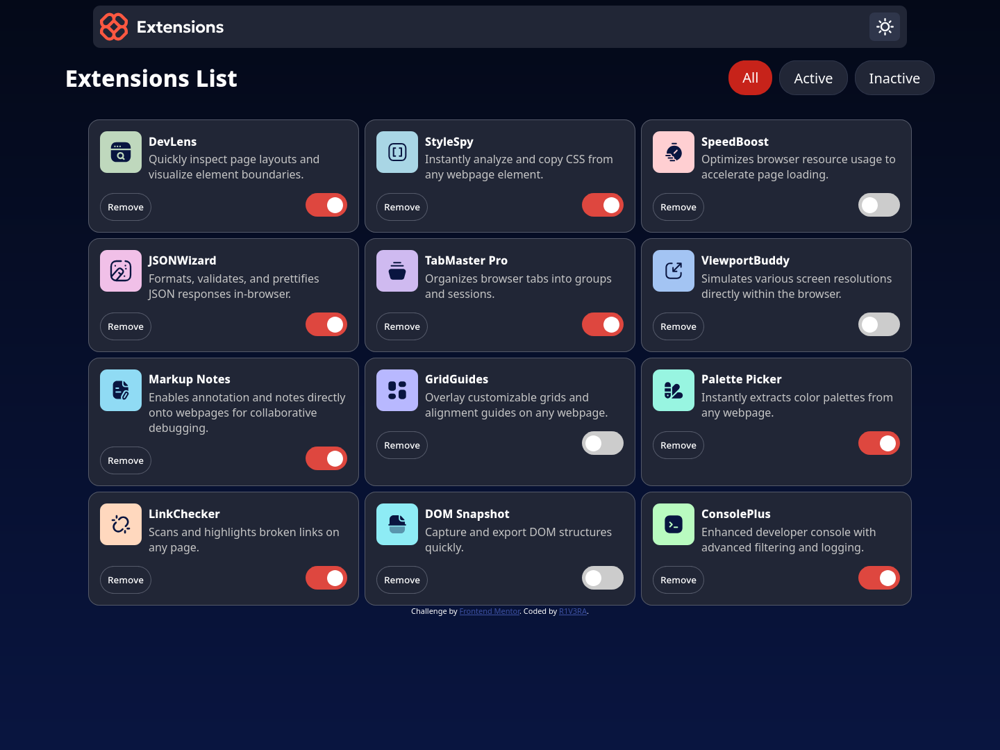

# Frontend Mentor - Browser extensions manager UI solution

This is a solution to the [Browser extensions manager UI challenge on Frontend Mentor](https://www.frontendmentor.io/challenges/browser-extension-manager-ui-yNZnOfsMAp). Frontend Mentor challenges help you improve your coding skills by building realistic projects. 

## Table of contents

- [Overview](#overview)
  - [The challenge](#the-challenge)
  - [Screenshot](#screenshot)
  - [Links](#links)
- [My process](#my-process)
  - [Built with](#built-with)
  - [What I learned](#what-i-learned)
  - [Continued development](#continued-development)
  - [Useful resources](#useful-resources)
- [Author](#author)
- [Acknowledgments](#acknowledgments)


## Overview

### The challenge

Users should be able to:

- Toggle extensions between active and inactive states
- Filter active and inactive extensions
- Remove extensions from the list
- Select their color theme
- View the optimal layout for the interface depending on their device's screen size
- See hover and focus states for all interactive elements on the page

### Screenshot



### Links

- Solution URL: [Solution URL](https://www.frontendmentor.io/challenges/browser-extension-manager-ui-yNZnOfsMAp)
- Live Site URL: [Live Site](https://browser-extension-manager-ui-main-eight.vercel.app/)

## My process

### Built with

- Semantic HTML5 markup
- CSS custom properties
- Flexbox
- CSS Grid
- Mobile-first workflow
- [React](https://reactjs.org/) - JS library
- Tailwind... Stop. I didn't used Tailwind like usual(


### What I learned

I learned how to work with JSON files, useState(), and React in general


```js
const App = () => {
  const [cards, setCards] = useState([]);
  
  useEffect(() => {
    fetch("./data.json")
      .then(response => response.json())
      .then(data => {
        setCards(data);
      })
      .catch(error => {
        console.error('Error fetching data:', error);
      });
  }, []);

  
    const toggleState = (index) => {
      const updatedCards = [...cards];
      updatedCards[index].isActive = !updatedCards[index].isActive;
      updatedCards[index].state = updatedCards[index].state === 'inactive' ? 'active' : 'inactive';
      console.log(index, ': ', updatedCards[index].isActive, updatedCards[index].state);
      setCards(updatedCards);
    }
      
    const removeCard = (index) => {
      const updatedCards = cards.filter((_, i) => i !== index);
      setCards(updatedCards);
    };
    *etc.*
}
```


### Continued development

I want to practice with React. Now my code looks like garbage, and I need to improve my skills in working with this library.

### Useful resources

- [Deepseek](https://chat.deepseek.com) - Helped me with coding on the React
- [DuckDuckGo](https://www.duckduckgo.com) - Just search engine


## Author

- GitHuh - [GitHub](https://www.github.com/r1v3ra-1508)
- Frontend Mentor - [@r1v3ra](https://www.frontendmentor.io/profile/r1v3ra-1508)


## Acknowledgments

Coding2GO ([YT](https://www.youtube.com/@coding2go)) - for theme switcher tutorial

